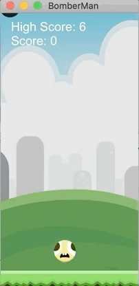
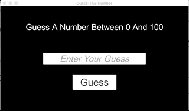

# GameDevLogTemplete
---

游戏开发日志模板

If you like, please give me a star. Thank you!

如果你喜欢，请点一下右上角的 `star`，非常感谢！

| IDE / 开发工具 | Version / 版本 |
|:---:|:---|
| macOS Catalina  | 10.15.1 |
| [Unity](https://unity.com) | 2019.2.15f1 Personal |
| [Unreal](https://www.unrealengine.com) | 4.23.1 |
| [Visual Studio Community 2019 for Mac](https://visualstudio.microsoft.com/vs/mac) | 8.3.10(build 2) |

## ScreenShots / 最新游戏截图


## Games List / 游戏列表

<https://github.com/GameDevLog/GameDevLogTemplete>

|| Game / 游戏 | Demo / 演示 |
|:--|:--|---|
| 1. |[Bomber Man](https://github.com/GameDevLog/BomberMan)<br />[Unity](https://unity.com)<br />2D<br />[Download(macOS/Linux/Windows)](https://github.com/GameDevLog/GameDevLogTemplete/releases/tag/v20191204)<br />[GameDevLog](https://game.iosdevlog.com/2019/12/04/BomberMan/)<br />2019/12/04 |  |
| 2. |[Guess The Number](https://github.com/GameDevLog/Guess-The-Number)<br />[Unity](https://unity.com)<br />2D<br />[Download(macOS/Linux/Windows)](https://github.com/GameDevLog/GameDevLogTemplete/releases/tag/v20191205)<br />[GameDevLog](https://game.iosdevlog.com/2019/12/05/Guess-The-Number/)<br />2019/12/05 |  |

## Version Control / 版本控制

### Git & GithHub

<https://game.iosdevlog.com/2019/12/03/Templete/>

### Commit 规范和格式化

```sh
npm install -g commitizen cz-conventional-changelog
echo '{ "path": "cz-conventional-changelog" }' > ~/.czrc
git add -A
git cz
```

## Contact / 联系方式

Website/网站: [http://game.iosdevlog.com/](https://game.iosdevlog.com/)

WeChat Official Account / 微信公众号:

* iOSDevLog / iOS开发日志
* AIDevLog / AI开发日志


## License / 许可

GameDevLog is released under the MIT license. See [LICENSE](LICENSE) for details.

Assets: [AwesomeTuts](AwesomeTuts)
